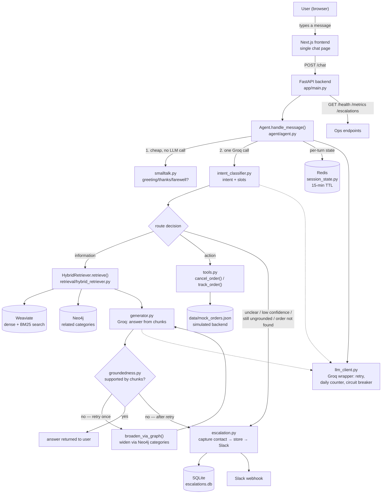
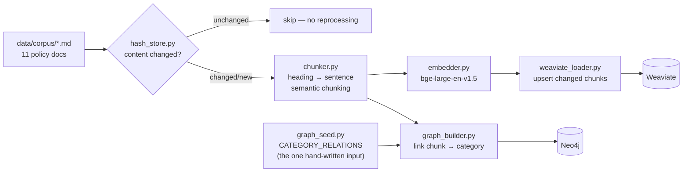

# System Architecture
 
One-page view of how a request flows through the system, and how the corpus gets there in the first place. For full design rationale, thresholds, and ownership, see `ARCHITECTURE.md`.
 
## Request flow
 

 
## Ingestion pipeline (offline — rerun when the corpus changes)
 

 
## What each box actually is
 
| Layer | Component | Role |
|---|---|---|
| Frontend | Next.js chat page | Anonymous `session_id` (localStorage), sends `/chat`, renders route/confidence badges |
| Backend | FastAPI (`app/main.py`) | Wires every shared client once at startup; `/chat`, `/health`, `/metrics`, `/escalations` |
| Decision core | `agent/agent.py` | The only place that decides information vs. action vs. escalate |
| Retrieval | Weaviate + Neo4j + `hybrid_retriever.py` | Dense + BM25 fusion (RRF), graph-broadened retry on failed groundedness |
| LLM | Groq (via `llm_client.py`) | Intent+slot extraction, answer generation — one wrapper, retry + circuit breaker |
| Action | `tools.py` + mock order store | Real function calls against a clearly-fake backend |
| Escalation | `escalation.py` + SQLite + Slack | Captures contact, stores permanently, posts live |
| Session memory | Redis | Pending question state, last completed order (one-turn memory) |
 
 